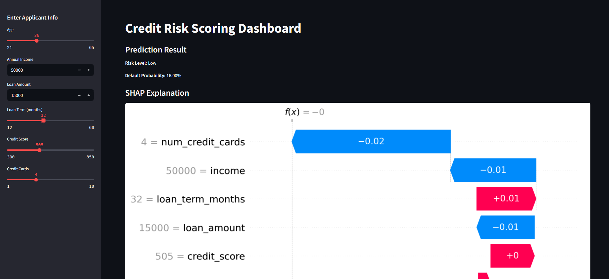

# Credit Risk Scoring + SHAP Explainability Dashboard

This project is a real-world machine learning application that predicts whether a loan applicant is likely to **default** and explains the prediction using **SHAP (SHapley Additive exPlanations)** in a user-friendly **Streamlit dashboard**.

---

## Project Highlights

- Predicts credit risk (loan default) using user-friendly financial inputs.
- Trained using a Random Forest model on synthetic but realistic data.
- Integrated SHAP to explain the impact of each feature on the prediction.
- Interactive Streamlit dashboard with sliders and visualization.

---

## Technologies Used

- Python
- Streamlit
- Scikit-learn
- SHAP
- Pandas
- Joblib
- Matplotlib

---

## Features

- Enter applicant details (age, income, loan amount, etc.)
- View prediction:
  - Whether the applicant is **risky** or **low-risk**
  - Default probability (e.g., 83.4%)
- Visualize the explanation using **SHAP waterfall plot**
- Clean UI optimized for decision-making

---

## How to Run

1. **Install Dependencies**
   ```bash
   pip install -r requirements.txt
   ```

2. **Train the Model**
   ```bash
   python train_model.py
   ```

3. **Run the App**
   ```bash
   streamlit run app.py
   ```

---

## Input Features

| Feature            | Description                            |
|--------------------|----------------------------------------|
| `age`              | Age of the applicant                   |
| `income`           | Annual income in local currency        |
| `loan_amount`      | Requested loan amount                  |
| `loan_term_months` | Duration of the loan in months         |
| `credit_score`     | Credit score (300 - 850)               |
| `num_credit_cards` | Number of credit cards the user holds |

---

## Output

- **Low Risk** prediction for good applicants
- **High Risk** prediction for potentially defaulting users
- **SHAP Waterfall Plot** for explanation:

### Sample Screenshot


